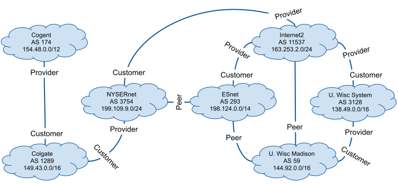
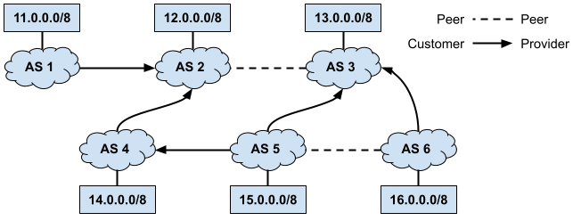

# Lab 06: Path vector routing simulator

## Overview
In this lab, you’ll write a path vector routing simulator that computes which paths a small set of autonomous systems (ASes) learn based on the relationships between.


### Learning objectives
After completing this lab, you should be able to:
* Compute the advertisements an AS sends to its neighbors
* Compute the path an AS uses to reach a destination

## Getting started

Clone your git repository on the `tigers` servers. Your repository contains:
* `simulator.py`: a partially written Python program for simulating path vector routing
* `topologies`: a directory with example network topologies

## Implementing the simulator
The provided code (in `simulator.py`) contains:
* `AutonomousSystem`: a class representing an AS, which keeps track of the AS’s number, prefix, customers, providers, and peers
* `Advertisement`: a class representing a route advertisement, which consists of a prefix and a path (i.e., list) of ASes the advertisement has traversed
* `load_topology`: a function that creates and relates `AutonomousSystem` objects based on topology information provided in a JSON file
* `compute_paths`: a function that will be the main driver of the simulation
* `main`: a main function

Your task is to complete the following functions:
* `send_advertisement` (in the `AutonomousSystem` class)
* `recv_advertisement` (in the `AutonomousSystem` class)
* `compute_paths`

You may add additional helper functions as desired.

Each `AutonomousSystem` will need to advertise its own prefix as well as any prefixes it learns from its customers/providers/peers that should be advertised to its other customers/providers/peers. Consult Section III.A of the paper *On Inferring Autonomous System Relationships in the Internet* to refresh your memory of the rules for advertising prefixes. **Your `send_advertisement` function should directly call the `recv_advertisement` function of the `AutonomousSystem` instance to whom the advertisement is being sent.** A shorter path is preferred to a longer path; if two paths have equal length, then the AS may prefer either path.

I recommend you propagate advertisements for one prefix at a time; after all advertisements have been propagated for one prefix (and each AS has determined its best path to that prefix), then you can propagate advertisements for the next prefix. 

## Testing the simulator
You can use the provided topologies (`linear.json`, `example.json` and `warm-up.json`) to test your simulator. You can run the simulator as follows:
```bash
./simulator.py -t topologies/TOPOLOGY_FILE
```
replacing `TOPOLOGY_FILE` with the name of one of the JSON files.

For example, your simulator should produce the following output for `linear.json`: 
```
***** Topology *****
AS 1 (11.0.0.0/8): cust=[]; prov=[2]; peer=[]
AS 2 (12.0.0.0/8): cust=[1,3]; prov=[]; peer=[]
AS 3 (13.0.0.0/8): cust=[]; prov=[2]; peer=[]
***** Paths *****
AS 1
        11.0.0.0/8: 
        12.0.0.0/8: 2
        13.0.0.0/8: 2 -> 3
AS 2
        11.0.0.0/8: 1
        12.0.0.0/8: 
        13.0.0.0/8: 3
AS 3
        11.0.0.0/8: 2 -> 1
        12.0.0.0/8: 2
        13.0.0.0/8: 
```

### Topologies
The example topologies are shown below.

#### linear.json


#### example.json


#### warm-up.json


## Submission instructions
When you are done, you should commit and push your changes to `simulator.py` to GitHub.
